# Mineral Exchange

### What problem are you solving by building this partiular marketplace app?
For this assignment I'm designing a web marketplace designed for sellers and collectors of rocks, fossils and minerals. My decision to chose this direction is because I have a close friend (and room-mate) who is an avid collector who needs to release a large majority of their collection. Outside of Ebay and Facebook marketplace there isn't really specialized marketplace options, the websites I have been able to find online are companies selling but don't allow a collector to sell their own collection. These websites also often very clunky and slow from both a functionality and design standpoint. <br>

### Why is this a problem that needs solving? 
This a problem that needs solving because my friends addiction is beginning to take over our household. With no good alternatives out there and eBay not returning the desired results. The Mineral Exchange Marketplace is the best chance I have to get my loungeroom back! 

# Links
- [Deployed site](https://limitless-earth-36988.herokuapp.com/)<br>
- [Github](https://github.com/ChristopherDalziel/mineral-exchange-2.0)

# Description of your marketplace app:
#### Purpose
The purpose of my marketplace app is to design a functional two-way marketplace that is easy to use for anyone with any level of expierence buying and selling online. To allow the sellers an effective way to display their minerals to sell and for potentional buyers to be able browse and purchase from the web-app.

#### Functionality & Features
##### Visitors
 - Can view sign up for a new account as a seller or a buyer via a sign up form that takes information such as name, email, password, address and contact number
 - Can view the websites current listings that are avalible for purchase as well as all listing data and attached questions and answers
 - Visitors can contact the web-app hoster via the email contact form
 - Cannot make a purchase

##### Sellers
 - Can create a listing of their own for sale via a form that takes in information like title, type, description, price and allows for an image upload
 - Have their own custom listings page where they can see all of their own posted listings
 - Can view, edit, or delete their previously created listings
 - Can see if their listing has been sold or is still for sale
 - Can view all avalible liistings on web-app by all sellers not just their own
 - Can view and edit their own personal seller profile that holds their information(Incase their contact or address changes etc)
 - Can answer and delete buyer questions on their own listings
 - Cannot make a purchase 
 - Sellers can contact the web-app hoster via the email contact form

##### Buyers
 - Can view all current listings on the website 
 - Buyers can chose to purchase a listing, upon selecting a purchase they will be re-directed to [stripe](www.stripe.com) to complete their payment before been re-directed back to the web-app to confirm. 
 - Buyers can ask sellers questions about their listings
 - Buyers can contact the web-app hoster via the email contact form

##### General
- Custom form inputs for contact, user sign ups and listing creation and editing
- Upon a listing been purchase the listing will be removed from the web-app ready for the seller to delete if they chose
- Input validation
- [AWS](www.aws.amazon.com/) Image hosting
- [Stripe](www.stripe.com) Payment system
- [Formspree](https://formspree.io/) Email forwarding

#### Sitemap


#### Target audience
My target audience for this web marketplace is primarly collects, sellers and buyers of different types of rocks, fossils and minerals. 

#### Tech stack 
- Ruby on Rails
- Ruby 2.5.1
- PostgreSQL
- Heroku (Deloyment)
- macOS

##### Third Party Services
- [Stripe](www.stripe.com) (Payment handling)
- [AWS](www.aws.amazon.com/) (Image hosting)
- [Formspree](https://formspree.io/) (Email forwarding)
- [Heroku](www.heroku.com/) (Deployment)

##### Gems
- Devise (For handling user sign ups)

# Epic/Stories


# Wireframes & Screenshots

### Homepage
##### Wireframe

##### Screenshot
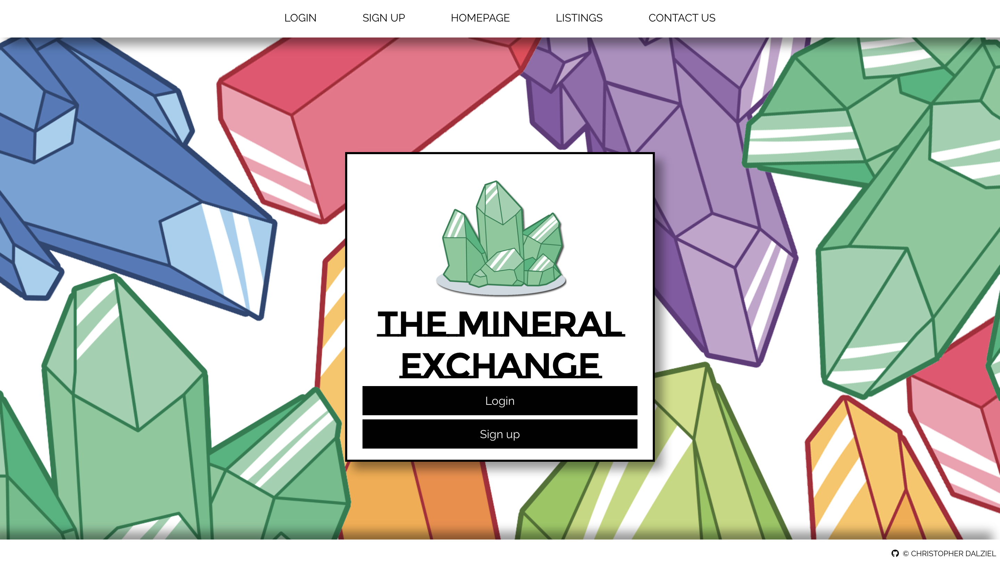
### Sign up page
##### Wireframe

##### Screenshot
### Listings page(Buyer)
##### Wireframe

##### Screenshot
### Listings page(Seller)
##### Wireframe
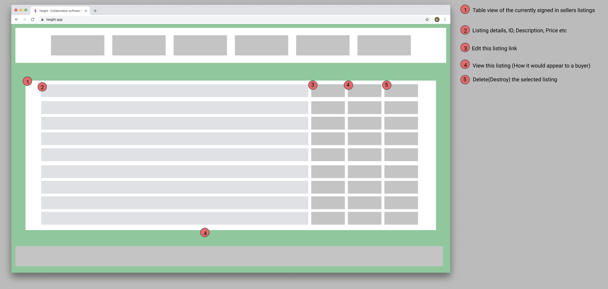
##### Screenshot
### Listings create
##### Wireframe

##### Screenshot
### Listings show
##### Wireframe

##### Screenshot
### Purchase success
##### Wireframe

##### Screenshot
### Purchase fail
##### Wireframe

##### Screenshot
### Contact Us
##### Wireframe
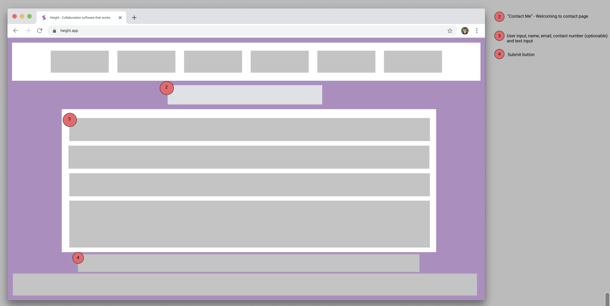
##### Screenshot
### Example Mobile Page Views
##### Wireframe


# ERD


## Explain the different high-level components (abstractions) in your app:
One of the high-level components in my application is Active-Record. Active-Record is a design pattern that uses the MVC (Model, View, Controller) to map the columns inside your table. Doing this provides us with ORM (Object Relational Mapping). <br>
Doing this allows us to access our SQL database (In our case PostgreSQL) without having to write SQL statements. <br>
Active-Record also allows us the ability to represent our models and their data, assosiations between our models, represent inheritance through related models and validate models before they get persisted to the database. These columns are accessed by methods are inffered inside the database schema.

## Detail any third party services that your app will use:
The Mineral Exchange app will use [Stripe](www.stripe.com) to handle payment systems, [AWS](www.aws.amazon.com) to handle image uploading and hosting, [Formspree](https://formspree.io/) is been used to handle the contact form for all users to use to contact whoever is controling the web-app, and [Heroku](www.heroku.com/) to deploy.

## Describe your projects models in terms of the relationships (active record associations) they have with each other:
Type: 
```
has_many :listings
```
- The type model has_many listings because each listing will have a type, and sellers can create as many listings as they'd like, so it's likely there will be more than one type used on our listings.

User: 
```
has_many :listings
has_one :user_detail
accepts_nested_attributes_for :user_detail
```
- The users model has many_listings because one user is able to post as many listings are they'd like.
- The users model also has_one user_detail, this is because the user_detail model is an extension of Users and gives us access to futher information, this is why User accepts_nested_attributes_for the user_detail table.

User_Detail:
```
belongs_to :user
belongs_to :state
has_many :states
```
- The user_detail model belongs to the User table because it's nested and gives extra information to that table.
- User_detail also belongs_to state because the state model gives information to the user_detail model and then the user_detail also has_many states because the state model can have many user_details.

Listing:
```
belongs_to :user
belongs_to :type
has_many :questions, dependent: :destroy
has_one_attached :picture
enum sold: { no: 1, yes: 0 }
```
- The Listing model belongs_to the user model, this is because a user is able to have a listing(or many, but this isn't shown here). 
- Listing also belongs_to the type model because it there are many different types that are able to be linked to a single listing.
- Inside of the listings model it has_many questions, this is because a single listing can have as many questions as the buyers ask, it also has a depedentcy destroy so when a listing is destroyed by a seller it also destroys the attached questions.
- The listing model is also has_one_attached picture, this is allows the user to upload one image of their own via AWS.
- Lastly the listings model holds a enum value which is set to 1 or 0 upon listing it's automatically set to "no" or "1" upon a succesful payment been made the enum is changed to "yes" or "0" this removes the listing from the buyers view.

Question:
```
belongs_to :listing
has_many :answers, dependent: :destroy
```
- The question model belongs_to the listing model because questions are attached to listing_id, so they aren't shown on an other listings other than the attached id
- A question has_many answers so the seller is able to answer as many times as required, this also has a destroy depedency so if a question or a listing is deleted so are the attached answer(s).

Answer:
```
belongs_to :question
```
- The answer model belongs_to the question model so the answer is only shown on the attached question_id not on all questions, this happens in exactly the same way as the initial question is attached to a listing_id


## Discuss the database relations to be implemented in your application:
erd
-
migrations
f-keys
tables erd

## Provide your database schema design:
In the schema screen shots below you'll see the different attributes and datatypes I've selected for the models/tables, I thought I would also go over some of the reasoning behind my choices on each table. <br>

##### Active Storage Attachment/Blob Models
- These tables are implimented for us by AWS when we install their functionality, and we don't have any choice over the attributes and datatypes.

##### Question/Answer Model
- For the subject line in the question model I used 'string' because a subject doesn't need to be longer than 255 characters
- For the body of each I used 'text' so both the buyer and the seller would be able to write as much as they needed.

##### Listing Model
- Inside the listings table I used 'text' once more the the seller would have enough room to add any amount of information they require
- I used 'integer' on both the price column however this was to function correctly with [Stripe](www.stripe.com)(As far as I'm aware Stripe only accepts integers) but also incase I needed to do any form of calculation for the payment now or in the future which wouldn't be possbile with a string.
- For the sold column I decided to make an 'enum' this was more for my own personal development I wanted to see how they worked even though for this assignment I've only used two fields 1 and 0 which is essentially just creating a boolean value. It was a learning expierence so in the future I can use both enums and boolean. 

##### User Detail Model
- The only thing really worth noting inside my user detail model is my use of integer for the postcode, although the postcode is a integer there isn't really any reason to store the datatype as such, it probably would have made a more sense to use a string and restrict the input using validation to 4. 

##### User Model
- The user model is created by devise however I did use a migration to add my own column 'is_seller' which takes the datatype 'boolean' I did this so I could split my users and allow them to access different parts of my website, I used 'boolean' as I said before so I had the expierence of using both boolean and enumn datatypes.

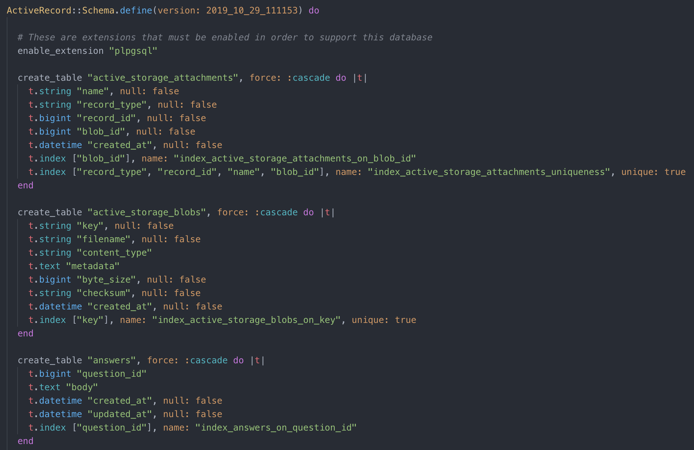
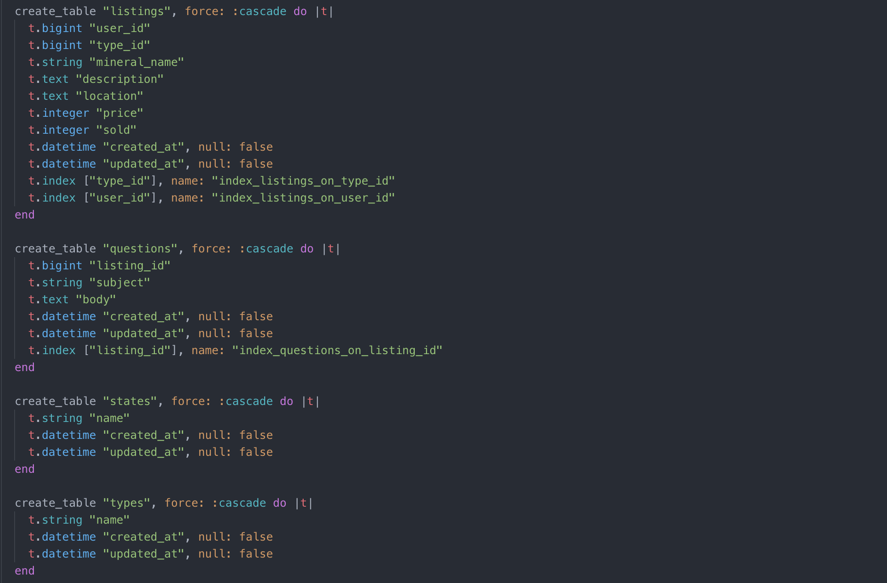
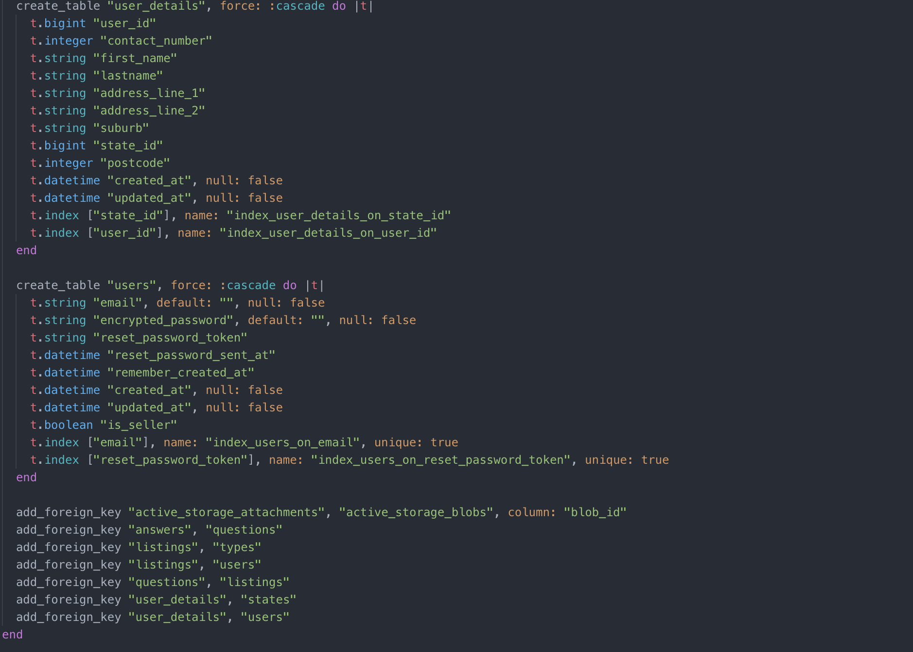
 
## Describe the way tasks are allocated and tracked in your project:
During this project I used [Trello](www.trello.com/) having used it in previous assignments I found it a really helpful way to keep tracking of what I need to do, what I'm currently working on and what I've completed already. During this project I also used the feature of Trello where you can add a due date for yourself, I used this to help myself stay on track with my progress.
You can see my attached screen grabs of my progress below.
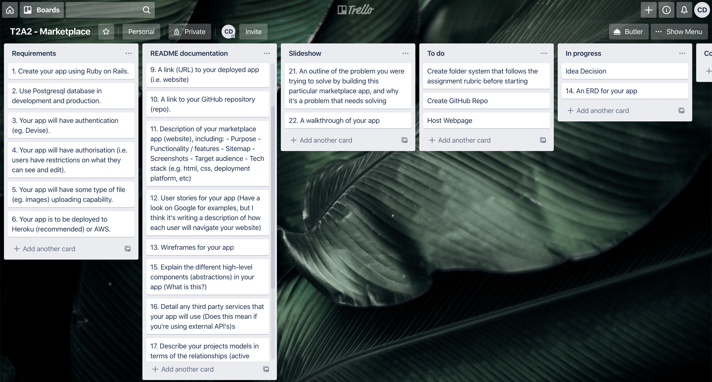
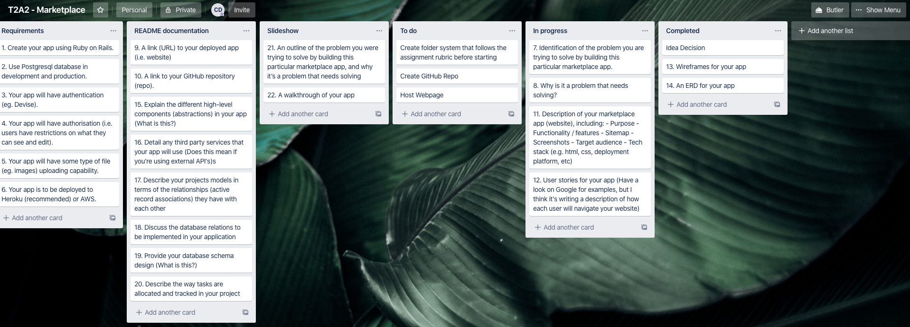
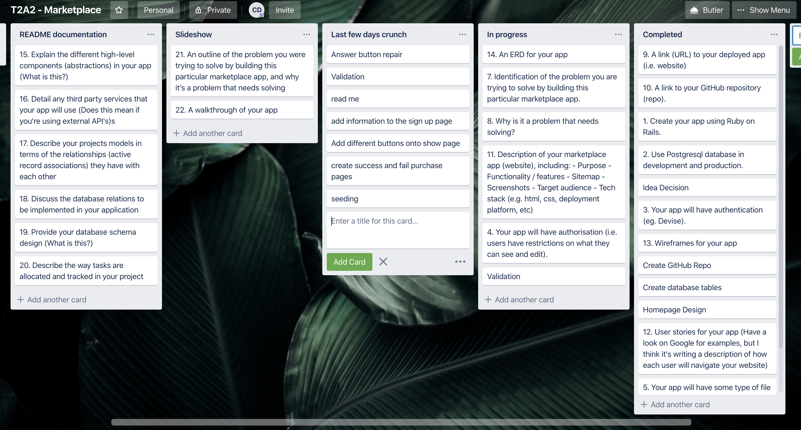
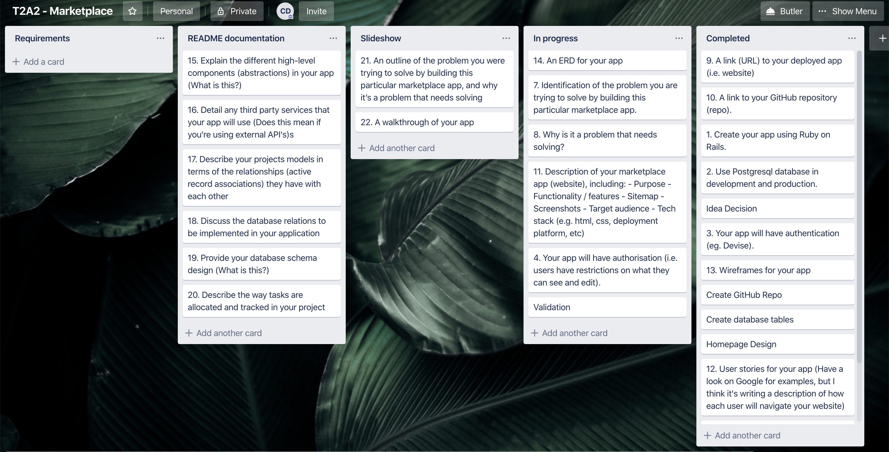
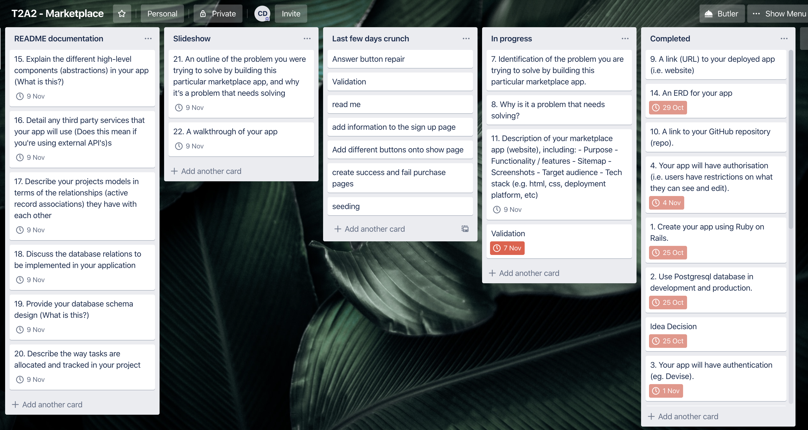
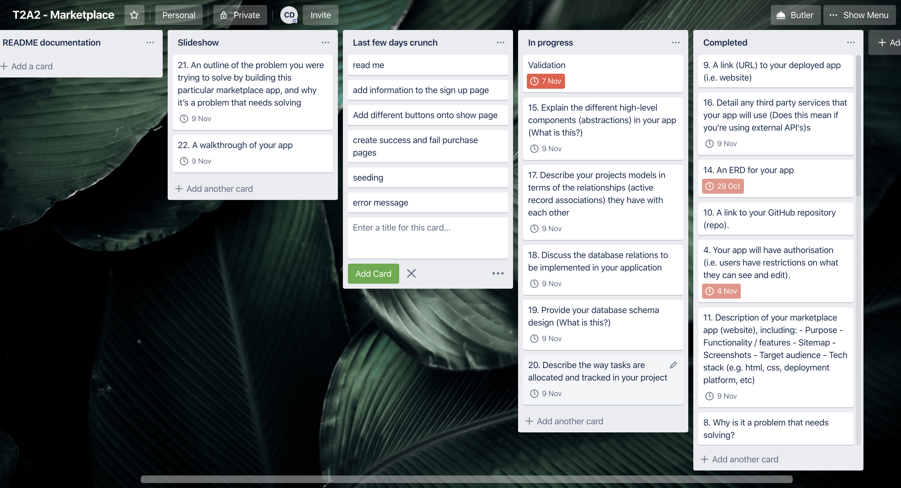

*Going to add trello screen shots here